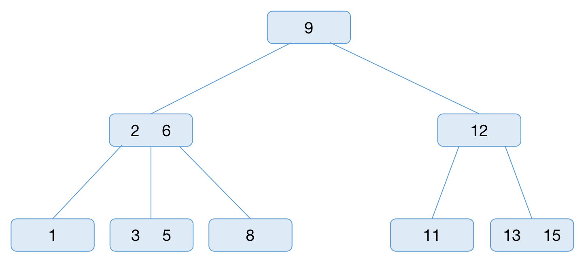
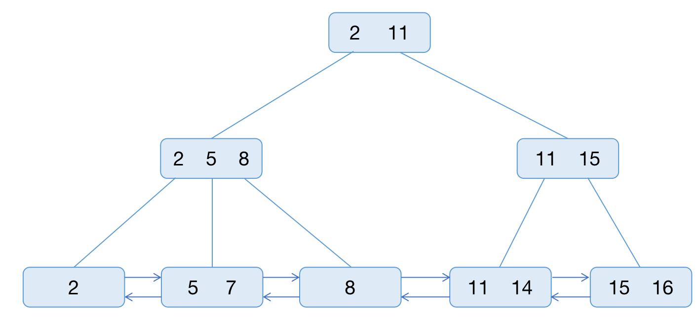
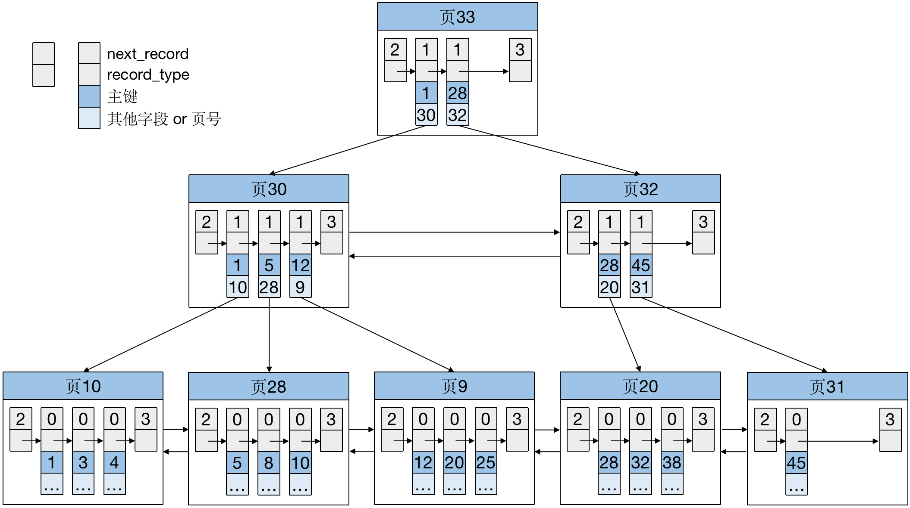
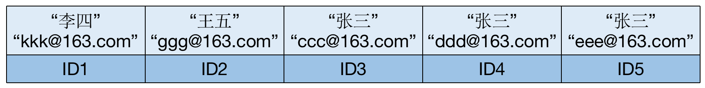
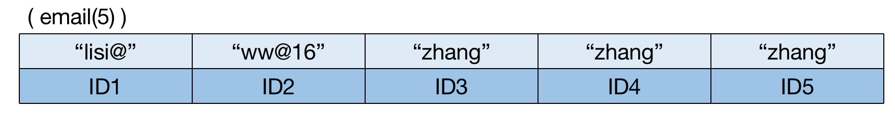
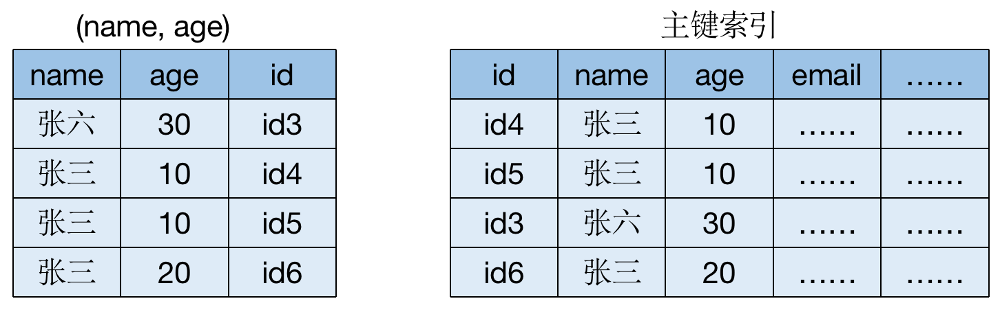

## 一、常见的实现方式

1. 哈希表

   哈希表是一种以键值对（key-value）存储数据的结构，输入 key 之后，能够以 O(1) 的时间复杂度找到对应的value。出现哈希冲突的时候就会拉出一个链表。

   优缺点：适用于等值查询的场景，但因为数据不是有序组织的，所以对于范围查询就必须做全表扫描。

   // todo 图 45讲

2. 有序数组

   有序数组会根据数据的大小按顺序将数据存放在数组中。

   优缺点：可以使用二分法以 O(logN) 的时间复杂度找到对应的数据，对于范围查询也支持。但是数据更新的成本很高，每次插入或删除都可能移动很多条记录，所以对于这种结构的索引，查询效率高，插入删除效率低，适用于储静态的数据。
   // todo 图 45讲

3. 查找树

   平衡二叉查找树的特点就是：每个节点的左孩子小于父节点，父节点小于右孩子。左子树与右子树高度之差的绝对值不超过1。查询的时间复杂度是 O(logN)，更新的时间复杂度也是 O(logN)。

   B-树：多路平衡查找树。每个节点最多包含 k 个孩子，k被称为 B树 的阶。一棵 m 阶 B树具有如下特点：

   * 根节点至少有两个孩子
   * 每个中间节点都包含 k-1 个元素和 k 个孩子，其中 m/2 <= k <= m
   * 每个叶子节点都包含 k-1 个元素，其中 m/2 <= k <= m
   * 所有叶子节点都位于同一层
   * 每个节点中的元素从小到大排列，节点当中 k-1 个元素正好是 k 个孩子包含的元素的值域分划。

   

   B+树：B树的变体。

   * 有 k 个孩子的中间节点包含有 k 个元素（B树中是 k-1 个元素），每个元素不保存数据，只用来索引，所有数据都保存在叶子节点。
   * 所有的叶子结点中包含了全部元素的信息，且叶子结点根据关键字的大小从小到大顺序链接成双向链表。
   * 所有的中间节点元素都同时存在于子节点。

   

   B+树的优点：

   * 查询的 IO 次数更少：中间节点不存储完整数据，只做索引，所以相同大小的数据页可以容纳更多的节点元素
   * 查询性能稳定：每次查询都必须找到叶子节点，而 B树最好的情况是只查根节点，最坏的情况是查到叶子节点，所以 B+树的每一次查找都是稳定的。
   * 范围查询简便：数据存放在叶子节点，并且所有节点组成大小有序的链表，所以找到第一个满足条件的节点后，直接在链表上做遍历即可。

## 二、InnoDB的索引实现方式

​		InnoDB 使用了 B+树作为索引底层实现的数据结构，每一个索引在 InnoDB 里面对应一棵 B+树。表中的数据根据主键大小顺序存放在主键索引的叶子节点中，这种索引方式的表称为索引组织表。

​		**上期内容回顾总结：**各个数据页可以组成一个双向链表，每个数据页中的记录会按照主键值从大到小的顺序组成一个单向链表，每个数据页都会为存储在它里面的记录生成一个页目录，在通过主键查找某条记录的时候，就可以在页目录中使用二分法找到对应的槽（数据页中的记录每 1-8 条，或者 4-8 条划分为一组，组内最大的记录的地址偏移量称为一个槽），然后再遍历该槽对应的分组就可以找到指定的记录。



## 三、主键索引和非主键索引

1. 主键索引（聚簇索引）

   主键索引的叶子节点存储的是整条记录的数据。

2. 非主键索引（二级索引）

   非主键索引的叶子节点存储的内容是记录对应的主键值。

3. 基于主键索引和普通索引的查询有什么区别？

   ```SQL
   create table T (
   	id int primary key,
       id_card varchar(20) not null,
       name varchar(50) not null,
       address varchar(128),
       KEY `idx_id_card` (id_card)
   )
   ```

   如果查询语句是 select * from T where id = 500，即主键查询方式，则只需要搜索 主键索引这棵B+ 树；

   如果查询语句是 select name from T where id_card = 'xxxx'，即走普通索引查询方式，则需要先搜索 id_card 索引树，得到 id 的值，再通过这个 id 去主键索引树搜索一次。回到主键索引搜索的过程称为回表。

## 四、联合索引

​		联合索引就是同时以多个列的大小作为排序规则。比如（name，email）索引：

* 先把各个记录和数据页按照 name 字段的大小进行排序
* name 相同的情况下，根据 email 的大小进行排序



## 五、覆盖索引

​		执行 select name from T where id_card = 'xxxx' 这条语句需要回表查询。如果这个查询操作很高频，那就可以将 id_card 索引换成 （id_card，name）联合索引，因为索引中包含了 name，查询的时候就不需要回表了，这种联合索引也称为覆盖索引。

## 六、前缀索引

​		如果索引列是字符串，假如字符串很长，那么建立的这棵索引树就会占用很大的存储空间。这时候就可以考虑只将字符串的前 n 个字符存放到索引中，也就是说，二级索引的记录中只保留字符串的前 n 个字符，这种索引称为前缀索引。前缀索引虽然可以节约空间，**但可能增加扫描的行数，并且无法支持使用索引进行排序的需求，因为前缀索引无法对索引列前 n 个字符相同但其余字符不同的记录进行排序。**

​		假如有个前缀索引（ email(5) )，现在执行下面这条 SQL 语句是怎么执行的？

```sq
select * from T where email like 'zhangaaa%';
```



* 首先在 email(5) 这个索引中，找到第一条满足条件的记录对应的 ID3
* 将 ID3 对应的值拿到主键索引中搜索，比对 email 字段的值是否满足 'zhangaaa%'
* 在 email(5) 索引中，通过链表找到下一条记录，判断是否满足条件，满足的话继续回表查询，否则结束查询。
* 可以看到这次查询总共有 3 次回表

那如果取 email 字段前 6 个字符来建立索引，同样的语句，怎么执行？


* 首先在 email(6) 这个索引中，找到第一条满足条件的记录对应的 ID3
* 将 ID3 对应的值拿到主键索引中搜索，比对 email 字段的值是否满足 'zhangaaa%'
* 在 email(6) 索引中，通过链表找到下一条记录，判断是否满足条件，满足的话继续回表查询，否则结束查询。
* 可以看到这次查询总共有 1 次回表

所以，使用前缀索引的时候，定义好前缀的长度，才能做到既节省空间，又不用额外增加太多查询成本。

那这个前缀长度该怎么定义呢？在建立前缀索引的时候需要关注区分度，区分度越高越好。因为区分度越高，意味着重复的键值越少，额外增加的查询成本也就越少。可以通过统计索引上有多少个不同的值来判断使用多长的前缀，前提是要有大量的数据作为支撑。

```sql
select count(distinct email) as L from T;
select 
	count(distinct left(email, 5)) as L5,
	count(distinct left(email, 6)) as L6,
	count(distinct left(email, 7)) as L7,
	count(distinct left(email, 8)) as L8
from T;

# 再通过 L5/L、L6/L、L7/L、L8/L 计算出占比。
```

## 七、前缀索引对覆盖索引对影响

​		前缀索引的影响其实不止前面提到的那些，也会让覆盖失效。如：

``` sql
select id, email from T where email = 'zhangaaa@163.com,';
```

这时候，就算只返回 id 和 email 这两个字段，也不得不进行回表，因为系统并不确定前缀索引的定义是否截断了完整信息。

## 八、最左前缀原则

​		对于联合索引（a，b，c），并不是说 a，b，c 三个字段需全部作为查询条件才能使用这个索引，查询条件如 a = xxx 或者 a = xxx and b = xxx，都可以使用这个联合索引来加速查询，这个就说索引的最左前缀原则，这个最左前缀可以说联合索引的最左 N 个字段，也可以是字符串索引的最左 M 个字符。

## 九、索引下推

```sq
select * from T where name like '张%' and age = 10;
```



MySQL 5.6 之前：

* 找到第一条满足条件的记录，对应的 id 为 id3
* 拿 id3 到主键索引检索出对应的记录，再对比其他字段的值
* 之后 id4、id5、id6 依次回表查询

MySQL 5.6 开始：

* 找到第一条满足条件的记录，对应的 id 为 id4
* 拿 id4 到主键索引检索
* 找到第二条满足条件的记录，对应的 id 为 id5
* 拿 id5 到主键索引检索
* 没有满足条件的记录，结束

可见，同样的数据，同样的查询语句，5.6 版本之前有 4 次回表，5.6 版本开始，引入了**索引下推**优化，只需要两次回表。

索引下推就是，InnoDB 在（name，age）索引内部就对 age 进行判断，对于 age 不满足条件的记录，直接跳过。

## 十、索引维护及页分裂

​		B+ 树为了维护索引有序性，在插入新值的时候需要做必要的维护。


​		以这个主键索引为例子，假设一个数据页只能存放3条用户数据。如果新纪录的 id 为 50，则只需要在 id 为 45 这条记录后面将新纪录加进去。如果新纪录的 id 为 6，正常情况下只需要将这条记录放到 id 为 5 的这条记录后面即可，但页 28 已经满了，这时候需要申请一个新的数据页，然后挪动部分数据过去。这个过程称为页分裂。更糟糕的是，新申请的数据页会多出一条目录项记录，需要将这条目录项记录放入页 30 中，但是页 30 也满了，所以页 30 也会执行页分裂的过程。

​		页分裂除了影响性能外，还会影响数据页的利用率。原本放在一个数据页的数据，现在分到两个数据页中，整体空间利用率大约降低 50%。所以，建表的时候我们一般都会建一个自增索引。

## 十一、索引失效

​		假设现在有一个表 T，表中字段为（id，name，age，email，address），其中 id 为主键，另外还建了一个联合索引（name，age，email）。

1. 违背最佳左前缀原则

   使用联合索引时，没有从索引的最左前列开始，就会引起索引失效，如果跳过排在中间的索引列，则后面的索引列不走索引。

   如：select * from T where age = 12;	select * from T where email = 'xxx';

   如：select * from T where name = 'xxx' and email = 'xxx'；因为跳过了 age，所以只有name = 'xxx' 会走索引。

2. 在索引列上做操作（计算，函数，类型转换等）

   如：select * from T where left(name, 5) = 'zhang';

3. 范围条件查询导致右边的索引列失效

   如：select * from T where name = 'xxx' and age > 25 and email = 'xxx';

   这条语句中，email = 'xxx' 不走索引。

4. 模糊查询以 % 开头

   如：select * from T where name like '%张'；

   如果又想 % 开头，又不想全表扫描怎么办？

   ``` sql
   # 建表语句
   create table t (
   	id int primary key auto_increment,
       name varchar(50),
       age tinyint,
       email varchar(50),
       address varchar(128)
   );
   
   explain select id from t where name like '%张';
   explain select name from t where name like '%张';
   explain select age, email from t where name like '%张';
   explain select email from t where name like '%张';
   explain select address from t where name like '%张';
   explain select name, age from t where name like '%张';
   explain select id, name from t where name like '%张';
   explain select id, address from t where name like '%张';
   
   
   
   
   alter table t add index idx_name_age_email (name, age, email);
   ```

5. 字符串不加单引号

